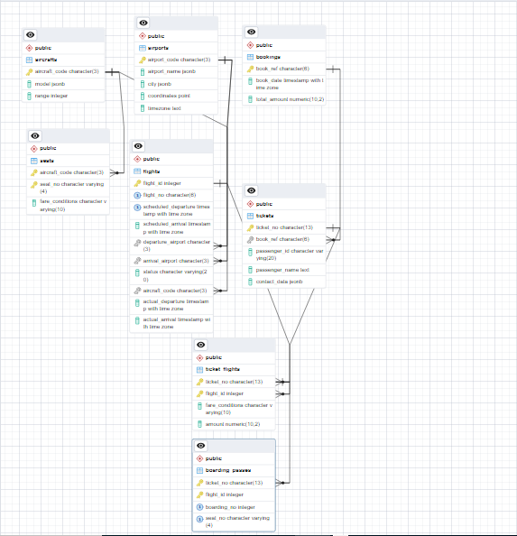

# AIRLINE DATABASE
## Project Overview
Airline databse contains data about a flight across Russian airspace within a particular period oftime.The database shows how different transactions and activity occurs in a typical Airspace Market. The queries from this database indicates how to solve and extract information from the database.

# TABLES
- Aircrafts
- Airports
- Boarding_Passes
- Bookings
- Flights
- Pilots
- Seats
- Ticket_flights
- Tickets

# SCHEMA
Here is the ERD

